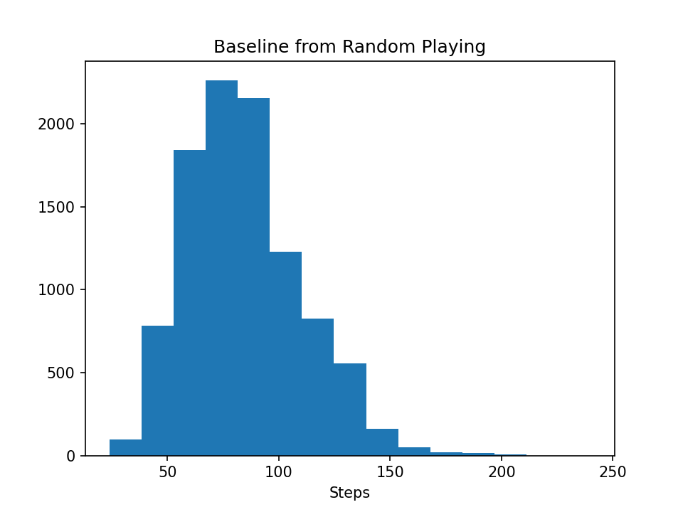
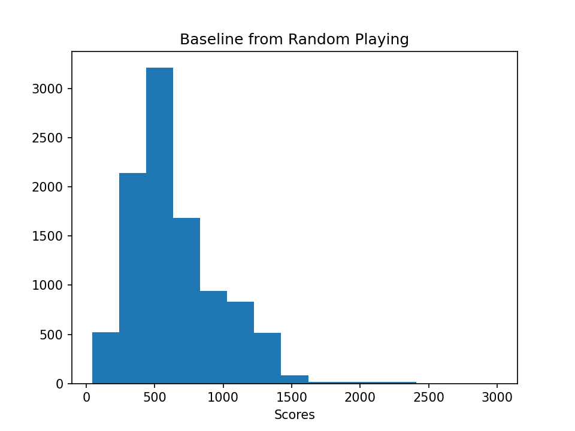
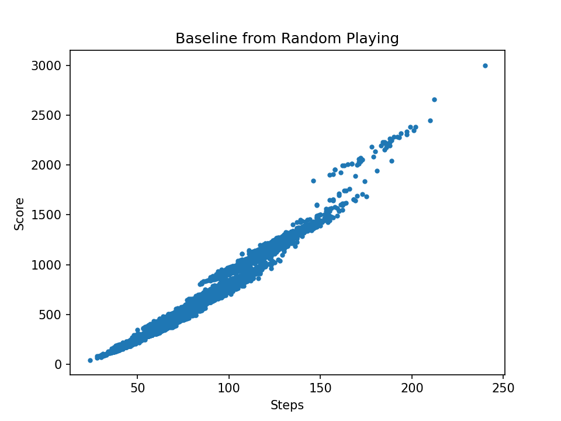
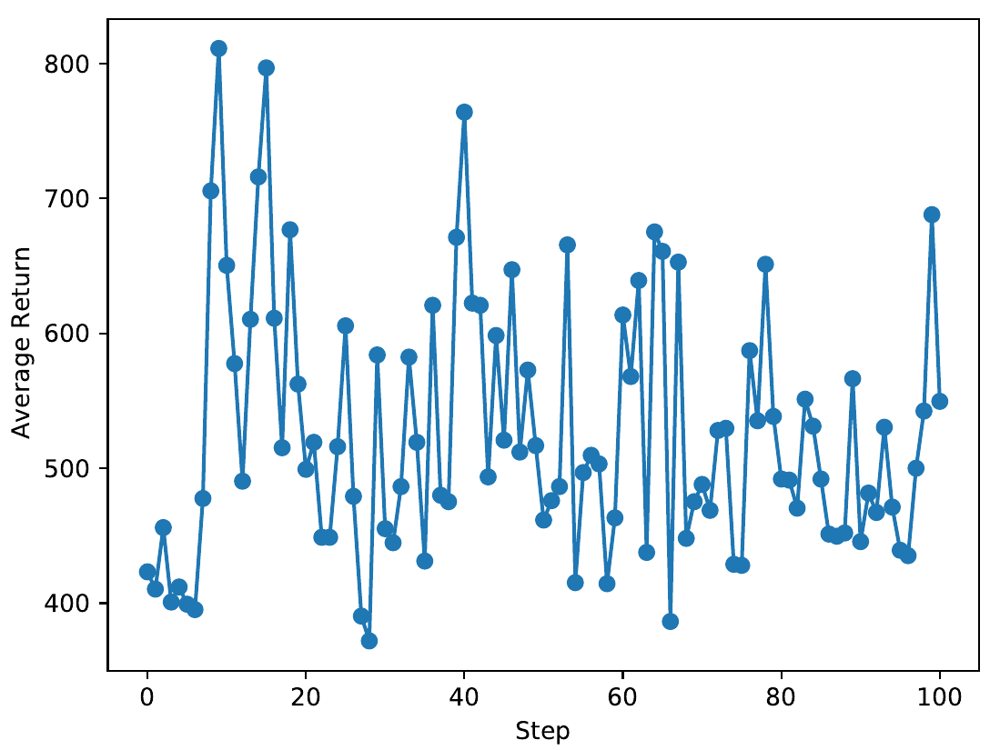
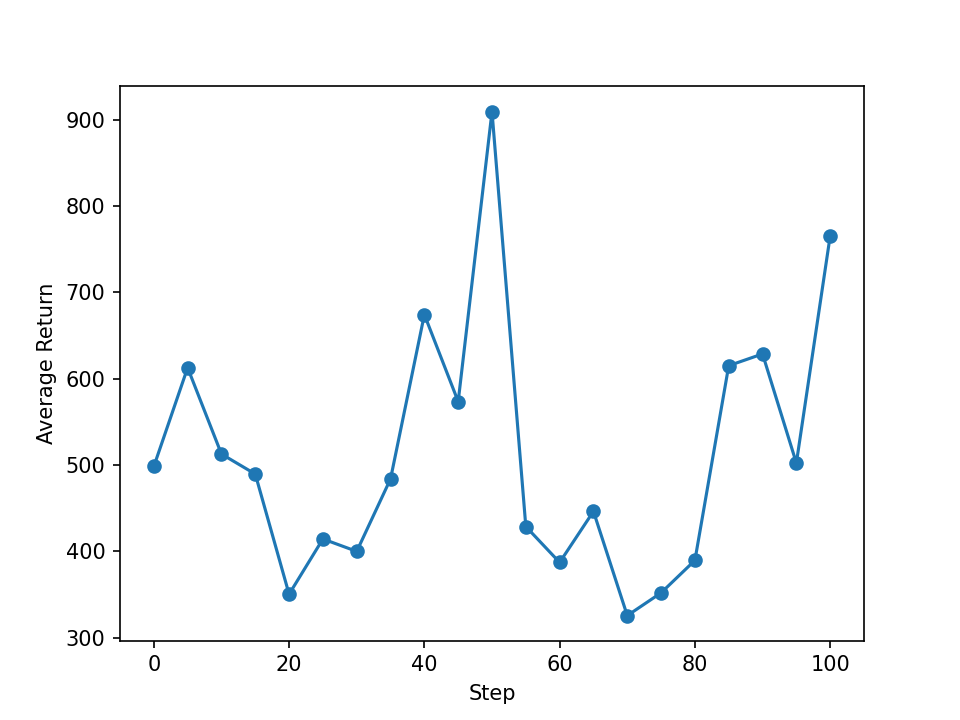
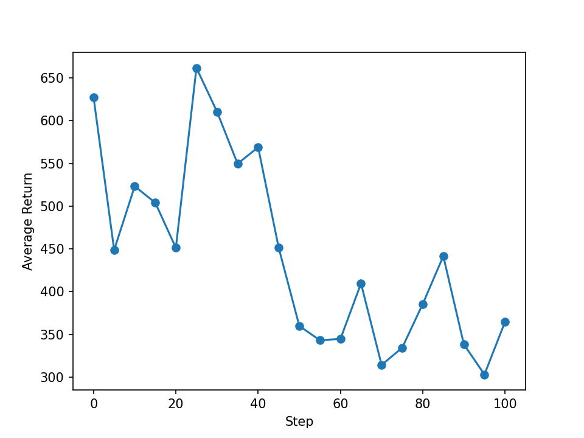
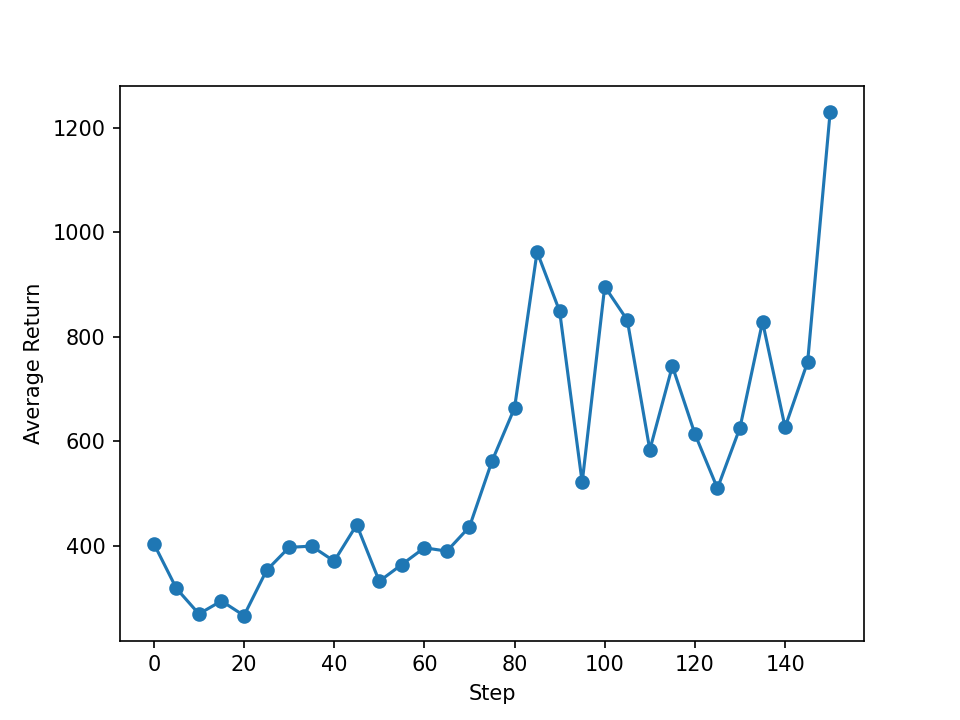
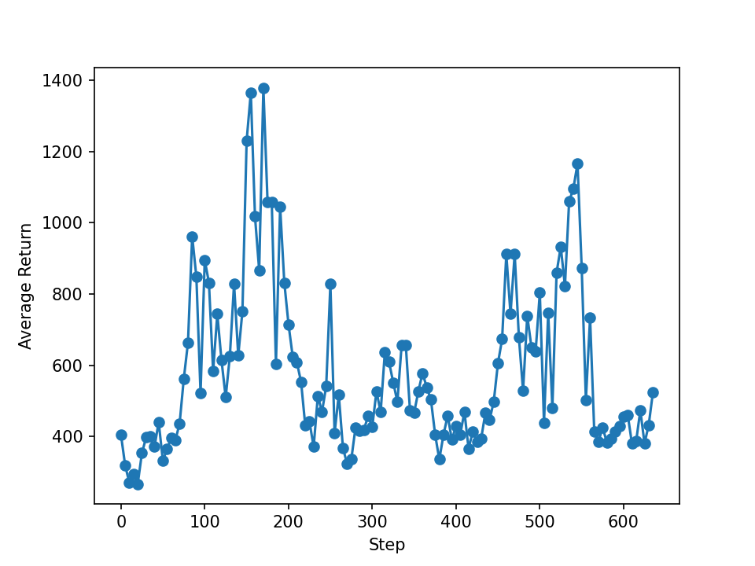
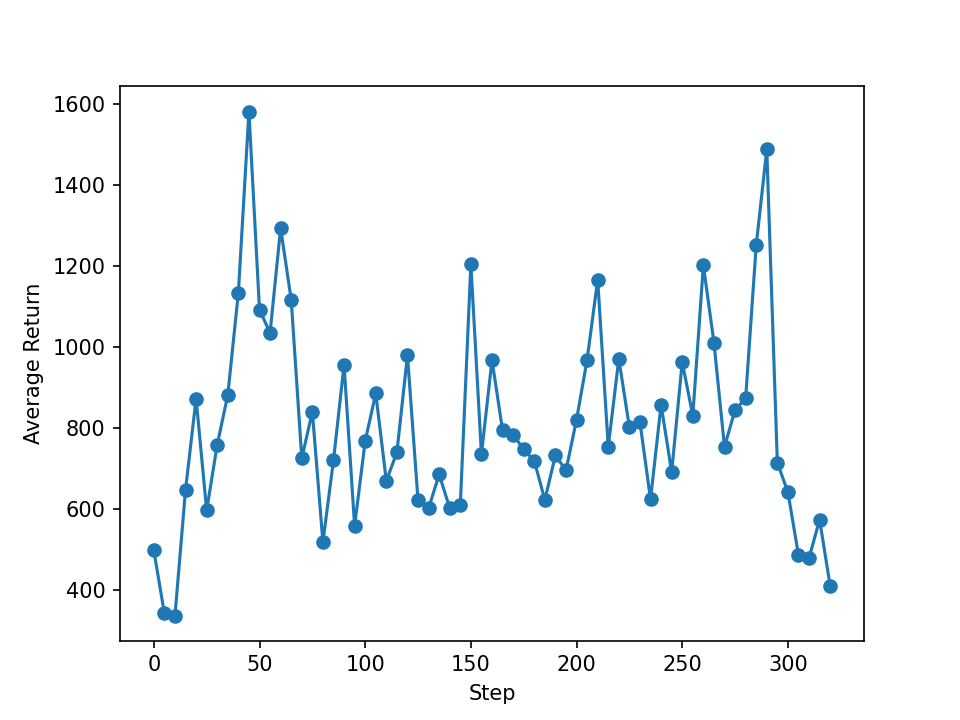

In the first post about [simulating Scythe](/posts/scythe-simulator-greedy/) I have used a beam search as a first attempt to find a good playing strategy. One of the things that I want to try with it is *machine learning*, in particular *reinforcement learning*. I've discussed the last article with other machine learning researchers and a suggestion has been to start with a simpler game to get into reinforcement learning. To start with, I wanted to have a single-player game such that I just have to train one agent. A suggestion was the [2048 game](https://play2048.co/), which is rather simple.

The game works like this: One has a 4×4 grid. The sites are either empty or have a tile with a power of 2 as value, starting with 2¹ = 2. The grid is initialized with two tiles at random positions. One can then move all tiles into one of the four directions (up, down, left, right). Empty spaces are compacted down. When two tiles with the same value touch, they merge into a tile with the sum of their numbers. After each such move, a new tile spawns. The new tile will have value 2 with 90 % chance and 4 with 10 % chance.

So in this post I will have a look at reinforcement learning on the 2048 game.

I've chosen TensorFlow to gain more experience with that technology. They have a [guide for the TF-Agents package](https://www.tensorflow.org/agents/overview?hl=en) that I found a good introduction to the topic.

<!-- END_TEASER -->

# Game implementation

First I needed to have an implementation of the game. This is was straightforward and I've created a Python module which creates the state for that. The move operations are not implemented in the most pretty way perhaps, but they functions are still rather short.

I represent the board as a NumPy array of integers, which I believe the obvious way to do it. That will likely not be the most sensible way to represent the game status to a neural network, though.

# Baseline with random policy

To get a baseline estimate I played the game again, after years of not playing it, and a score of around 3300. I would expect that a good agent would easily do the same. But we start with a randomly initialized agent, so we will have to get a baseline for that in order to figure out whether an agent has is making progress.

I simply simulated 10,000 plays of the games where the player would randomly choose the actions. This of course is not a great way to play. We can see how many steps were possible before the game has ended as the grid was full of tiles.



And the scores are usually between 500 and 1000, sometimes it managed to to reach 3000.



In a scatter plot we can see that there is a gap in the score, likely because a large merger was achieved.



This means that a trained agent would need to achieve a score of more than 2000 before I would really see a training result.

# Setting up the environment

In order to use TensorFlow Agents, one has to package the game into an *environment*. It is an interface that specifies a couple things:

- Tensor shapes of the observation that the agent may see of the game state.
- Tensor shapes of the actions that the agent may perform.
- A step function that takes a chosen action and returns the next state of the environment.
- A reset function that, well, resets the environment.

In this particular case the action is just a scalar that takes the numbers 0, 1, 2 or 3 to encode the direction. The step function will be a wrapper that translate this integer number into the direction. It will also check whether the game has ended and signal that to TensorFlow.

The representation of the observation is rather tricky. It will have to be tailored to the neural network. I will just start with the most naive approach and pass the board as is to the network.

For the agent I just use the *reinforce* agent that comes with TensorFlow. The default is a single dense layer with hidden dimension 100. I'll just copy this, we can adjust this later. At this point just any agent to start with will be okay. And then I copy the training loop from the guide to get started.

# First training

The first training plays the game twice, evaluates and trains the network on that. Then it goes for 100 such iterations (playing the game 200 times in total) and evaluates how well it scores. Plotting these results show that the agent is basically only randomly playing the game.



This is not a real big surprise as the representation of the game state to the network is bad. The representation with a two-dimensional grid of integers from 2 to 2048 and even higher doesn't work well for a neural network. They work well when the numbers are in the range of $[-1, 1]$. Also the network would have a really hard time to learn some sort of “binning” of the numbers into classes using biases and activation functions.

# One-hot encoding of the state

We should therefore change the representation to be *one-hot encoding*. Fortunately there is a limit on the largest tile value, [namely 131,072](https://de.wikipedia.org/wiki/2048_(Computerspiel)), which is $2^{17}$. We then have 18 classes that we need to represent. The empty sites will be represented as the 0th class, and then we have 17 classes from $2^1$ to $2^17$. The game state is then a tensor of shape (4, 4, 17).

Also I have changed it such that it does 5 plays of the game before training the network on the output. Also I only evaluate every 10 steps in order to have more training steps in between. The training result isn't really any better:



# Flatten the grid

The grid is inherently a two-dimensional structure. But it is not a matrix of values in this sense. The network will need to learn the spatial relations between them, but it just cannot do that with a matrix. The way that matrix multiplications work we have the issue that things from rows and columns get summed up, no matter how their neighborhood relation is. This is not particularly clever as the network would not be able to distinguish a row like (4, 2, 4, 0) from (4, 4, 2, 0). The former could not be merged, but the latter could be.

In order to fix this, I will flatten the spatial information into a vector with 16 elements. The state tensor will then have shape (16, 18).

Likely the network is just not deep enough to do anything meaningful there. Still I train it to see what this change brings. And this doesn't seem too great.



# Deeper network

We have 16 grid sites and 18 possible states that they can be in. With a single hidden layer with 100, we there will be a hidden state tensor with shape (16, 18, 100) that gets contracted with the input. The output is a single scalar, so there will another layer with a tensor of shape (100) which brings that down to simply (1).

I want the network to be able to build concepts like neighboring tiles. For this it needs to have enough layers to represent this. I have tried a stack of three dense layers with 32 hidden states each.

When training this at first, it looked really promising:



But as the steps have progressed, it became clear that this was just a random spike.



# One-hot encoding for the actions

In code I have copied from the cart-pole example, the output was a binary thing, and therefore represented as a single floating point number. That makes sense. But having floating point numbers for four discrete actions doesn't help. The network will try some regression on category indices, but that doesn't make any sense. So I will change that to one-hot encoding as well. From the response vector I will then take the argmax.

The training looks rather horrible, though:



I took a look into the values that come out of the network, they look like this:

	[0.5097685  0.5087578  0.49733114 0.5149286 ]
	[0.5012356  0.50089294 0.49857423 0.5031367 ]
	[0.50756246 0.50583476 0.4933096  0.51673365]
	[0.50037825 0.5040313  0.49242675 0.5100439 ]
	[0.50394684 0.5009199  0.49868914 0.50587016]
	[0.5074538  0.50674033 0.49198946 0.5183166 ]
	[0.518693   0.50395644 0.49058518 0.5316613 ]
	[0.52187884 0.5045646  0.48844635 0.53768843]

They all look roughly the same, and the argmax on them is not really meaningful. It looks like there is no softmax application at the very end.

The network definition is just copied from the guide.

```py
    actor_net = actor_distribution_network.ActorDistributionNetwork(
        train_env.observation_spec(),
        train_env.action_spec(),
        fc_layer_params=fc_layer_params)
```

The network is summarized as such:

	Model: "ActorDistributionNetwork"
	_________________________________________________________________
	Layer (type)                 Output Shape              Param #   
	=================================================================
	EncodingNetwork (EncodingNet multiple                  11492     
	_________________________________________________________________
	NormalProjectionNetwork (Nor multiple                  24        
	=================================================================
	Total params: 11,516
	Trainable params: 11,516
	Non-trainable params: 0
	_________________________________________________________________